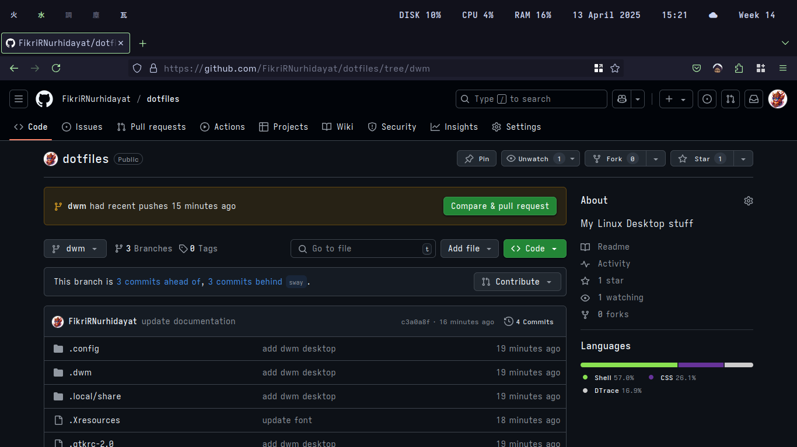
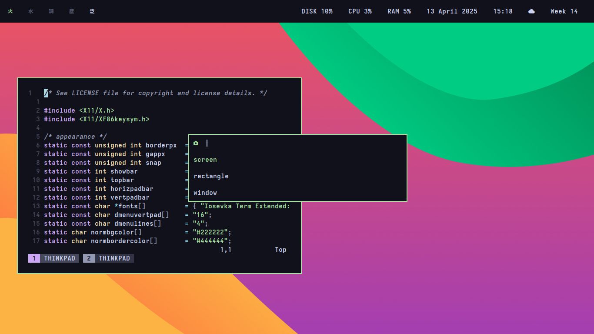
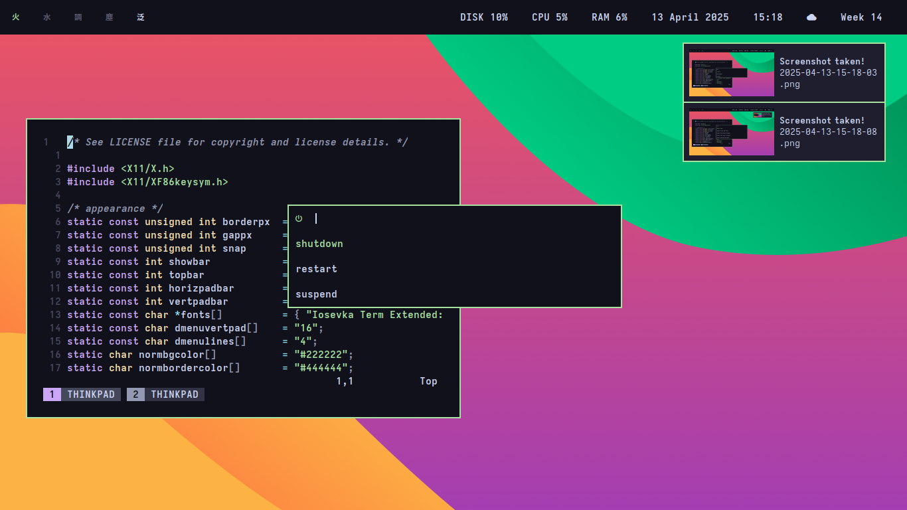
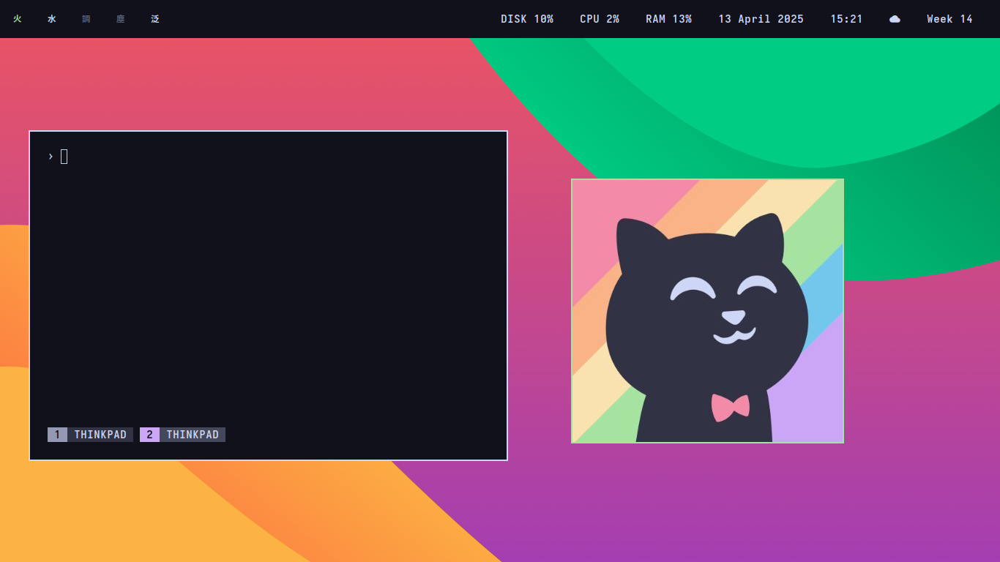

# Dotfiles

This repository contains my desktop configuration.

# Requirements

Arch Packages:

```
dunst
libnotify
feh
maim
```

Git Repositories:

- [`dwm`](https://github.com/FikriRNurhidayat/dwm.git)
- [`st`](https://github.com/FikriRNurhidayat/st.git)
- [`slstatus`](https://github.com/FikriRNurhidayat/slstatus.git)
- [`dmenu`](https://github.com/FikriRNurhidayat/dmenu.git)

# Screenshots








