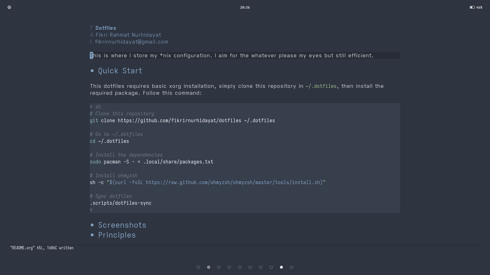
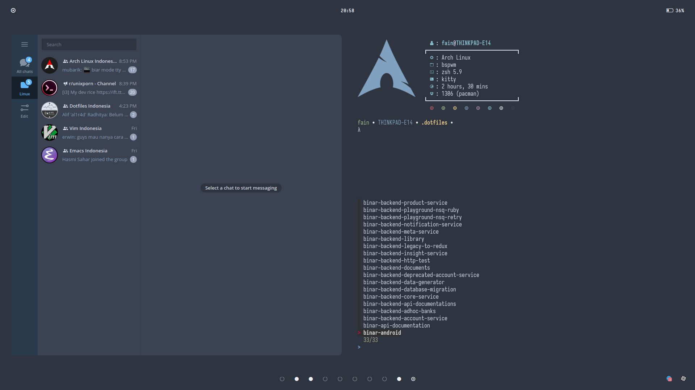
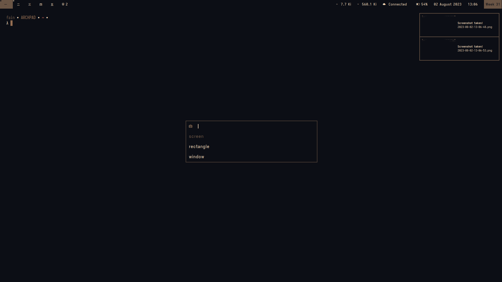
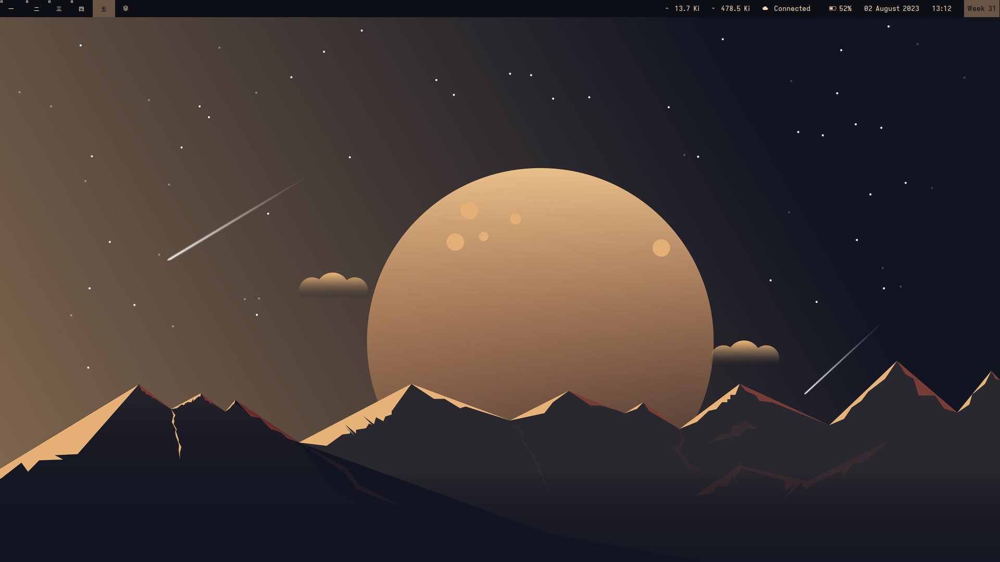

#+title: Dotfiles
#+author: Fikri Rahmat Nurhidayat
#+email: fikrirnurhidayat@gmail.com

This is where I store my *nix configuration. I aim for the whatever please my eyes but still efficient.

* Quick Start

This dotfiles requires basic xorg installation, simply clone this repository in =~/.dotfiles=, then install the required package. Follow this command:

#+begin_src sh
# Clone this repository
git clone https://github.com/fikrirnurhidayat/dotfiles ~/.dotfiles

# Go to ~/.dotfiles
cd ~/.dotfiles

# Sync dotfiles
.scripts/dotfiles-sync

# Install the dependencies
sudo pacman -S - < .local/share/packages.txt

# Install ohmyzsh
sh -c "$(curl -fsSL https://raw.github.com/ohmyzsh/ohmyzsh/master/tools/install.sh)"
#+end_src

* Principles

This configuration and all associated modules intend to follow the below principles. I use *nord* by the way.

*NOTE:* Some of these may change over time as we learn from this process.

** Simple

Every software that I use as a solution *MUST* be simple, and easy to configure. The implication of this is whenever I get back to this configuration, I should be able to modify it without extensive reading to relearn how it was configured.

** Efficient

Choice of software to be used to cater the daily drive needs *MUST* be an efficient software. It *SHOULD* comply to unix philoshopy, where I can build software on top of it, such as the extensibility of =dmenu= and =rofi=.

** Aesthetically Pleasing

The look of my desktop and what ever it is that I configure *MUST* be aethectically pleasing to my eyes, so I don't care about bloat since I use modern computer anyway. The aesthetic point *MUST* not contradict the simple principle and efficiency.

* Software Used

- [[https://github.com/fikrirnurhidayat/dwm][My dwm build]] (window manager)
- [[https://github.com/fikrirnurhidayat/slstatus][My slstatus build]] (status info)
- [[https://github.com/fikrirnurhidayat/st][My st build]] (terminal)
- [[https://github.com/fikrirnurhidayat/dmenu][My dmenu build]] (not just an application launcher)
- [[https://github.com/dunst-project/dunst][dunst]] (notification backend)
- [[https://www.gnu.org/software/emacs/][emacs]] (not just a text editor)

* Dude, your documentation sucks!

Yeah, I know, send me an [[mailto:fikrirnurhidayat@gmail.com][email]] if you have any question tho.
  
* Screenshots

*emacs*

*telegram*

*st*

*dwm*

